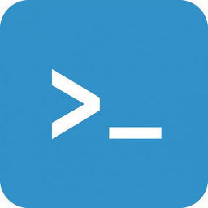

# ioBroker.ntfy-sh

## Unofficial ntfy.sh adapter for ioBroker

Send notifications to [ntfy.sh](https://ntfy.sh) directly from ioBroker. This adapter is a community project and not affiliated with ntfy LLC.

### Features
* Complete adapter with basic authentication and bearer token support.
* Allows configuration of custom server URLs (or uses the standard ntfy.sh instance).
* Features an integrated `sendTo` Blockly block to effortlessly dispatch notifications in graphic scripts.
* Messages can be simple strings or complex payloads containing the topic, title, and priority.

### Blockly Examples
Under the **Sendto** category, use the `ntfy` block to dispatch a message:
1. Set the **Instance**.
2. Set the **Message**.
3. Set the **Topic** (Required).
4. Set an optional **Title**.
5. Pick a **Priority**.

### JavaScript Example
```javascript
sendTo('ntfy-sh.0', 'send', {
    message: 'Motion detected in the backyard!',
    title: 'Security Alert',
    topic: 'home_alerts_xyz',
    priority: 'high'
});
```

### Authentication
Ntfy supports a few variations:
* **None**: Suitable for standard ntfy.sh servers (topics are public!).
* **Basic Auth**: Setup a local server with Username and Password.
* **Access Token**: Create tokens and use Bearer token validation for your topic.

## Changelog
### 0.1.1 (2026-03-17)
* (lubepi) Migrate admin UI to jsonConfig (Admin 5+)
* (lubepi) Add VS Code settings with ioBroker JSON schemas
* (lubepi) Setup GitHub Actions for automated releases via NPM Trusted Publishing
* (lubepi) Update adapter icon and add legal disclaimers
* (lubepi) Add i18n translations for admin settings
* (lubepi) Remove legacy admin UI files

### 0.1.0 (2026-03-16)
* (lubepi) initial release with full ntfy.sh support

## License
MIT License - Copyright (c) 2026 lubepi <https://github.com/lubepi>

## Legal Notice
This adapter is **NOT** an official product of ntfy LLC. The name **ntfy**, the logo and branding are trademarks of ntfy LLC. This adapter is a community project to provide integration into ioBroker.
